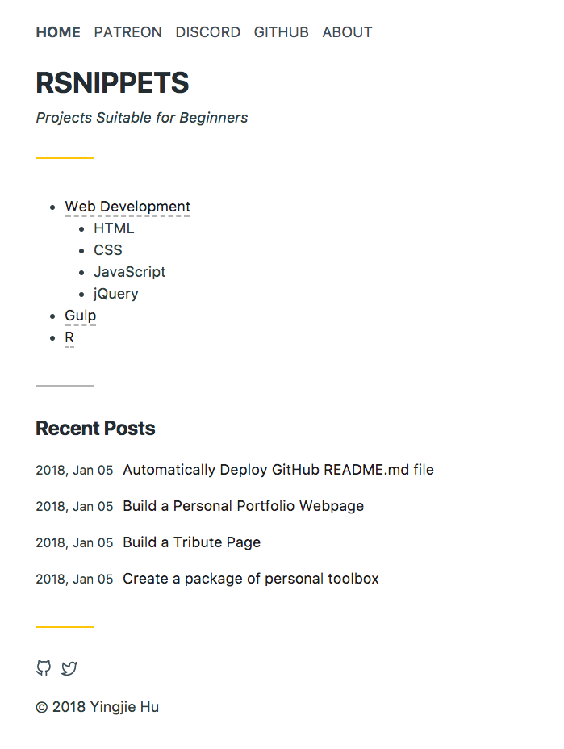


<!-- more -->

This project was done in the middle of [100 Days of Web Develpoment challenge](/100-Days-Of-Web-Development-Round-1/).

[Github Repo](https://github.com/huyingjie/rsnippets) | [Project 12: RSnippets.com](http://rsnippets.com/)

Link: [RSnippets.com](http://rsnippets.com/) 

The site is auto-deployed. 

## Milestone

1. The website is published to internet. ([2018-01-05 Friday](#2018-01-05-Friday))
2. First pull 
3. Over 100 stars

## Support open source projects

<a href="https://www.patreon.com/bePatron?u=8604867" data-patreon-widget-type="become-patron-button">Become a Patron!</a>

## 2018-01-05 Friday

I learned several programming languages by myself and failed, such as PHP. Every time I planned to learn a new programming language, I would look for books to read, video tutorials on Lynda.com, videso on YouTube. After doing this for several times and reading books for several years, I found people provided more books than necessary in a book list for beginners. The book list is so long that it overwhelms and discourages beginners; beginners will quit after reading first several hundred pages without a completed project. Watching tutorials a faster learning method than reading. But without doing any projects or exercise after watching, forgetting is the final outcome.

Usually, I have an idea, then search online for the technology involved. One project makes use of multiple programming languages. If I went through the all process of reading books first and doing projects next, I would not complete any project when considering there were a lot of things to do in other aspects of life. 

One solution I saw some people mentioned online is to have a project at hand before learning a language. Well, the problem is that as a beginner,  I will underestimate the complexity of the projects I choose most of time. If I have a question, the answers online involve lots of knowledge I do not know, and thus I cannot understand the solutions at all.

I have been in the two loops for several years, reading books which can over 500 pages or not understanding solutions online.

In December 2017, I started (again) learning front-end web development with [FreeCodeCamp.com](http://freecodecamp.com). I am amazed at projects in the website. They requires **limited knowledge** and beginners can **build a website that can be shown to other people**. 

One thing I learned in the process is that learning and practicing should be mixed together. The method was used when we were in school. As an adult, sometimes we forget it; sometimes we rush to our goal: finish reading books; sometimes we want to have some practice, but we have no idea what projects should be picked.

[RSnippets.com](http://rsnippets.com) is a website that collects projects suitable for beginners. They can proudly put completed projects on a personal portfolio page. They do not need full understanding or leanring the programming language to start a project.